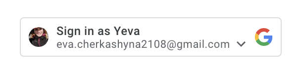
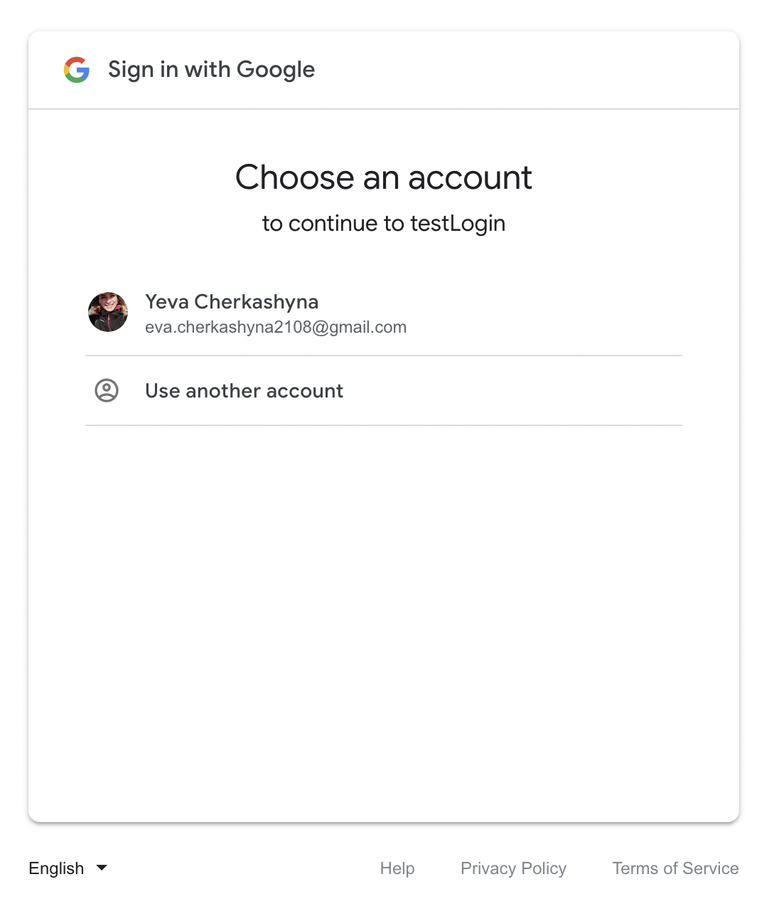
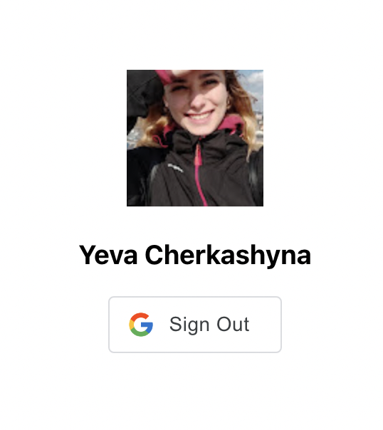

# Google app login 
[![React][react.js]][react-url]
[![TS][ts]][ts-url]
[![Google Identity][google]][google-url]


## Step 1:
Sign in 


## Step 2:
Choose an account 


## Step 3:
You signed in to the app with google




## ⚡️ Quick start

#### Node version `v14.18.1`

1. Clone the repo:
```sh
 git clone https://github.com/EvaCherkashyna/Meeting-Room-Incora.git
```

2. Install NPM packages:

```sh
 npm install
```

3.  Run the application:

```sh
 npm run start
```


[react.js]: https://img.shields.io/badge/React-20232A?style=for-the-badge&logo=react&logoColor=61DAFB
[react-url]: https://reactjs.org/
[mui]: https://img.shields.io/badge/mui-000000?style=for-the-badge&logo=mui&logoColor=white&color=007FFF
[mui-url]: https://mui.com/
[ts]: https://img.shields.io/badge/typeScript-000000?style=for-the-badge&logo=ts-node&logoColor=white&color=3178C6
[ts-url]: https://www.typescriptlang.org/
[google]:https://img.shields.io/badge/Google%20Identity-000000?style=for-the-badge&logo=google&logoColor=blue
[google-url]:https://developers.google.com/identity
